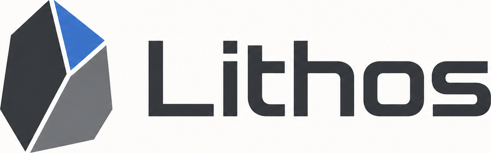

<div align="center">



### Normes de développement logiciel en collaboration avec l'IA

*Inscrire la manière dont les humains et l'IA construisent le logiciel ensemble.*

[English](README.md) · [中文](README.zh-CN.md) · [Français](README.fr.md) · [Русский](README.ru.md) · [Español](README.es.md)

</div>

---

## Ce qu'est Lithos

Lithos est une norme ouverte décrivant **la manière dont les humains et l'IA collaborent sur le logiciel**. Elle définit les rôles, les frontières d'approbation, la discipline de travail et les preuves qu'un projet doit attendre lorsque des personnes et des agents construisent du logiciel ensemble — sans imposer d'outil, de fournisseur ni d'environnement d'exécution particulier.

Elle existe parce que le développement assisté par l'IA est désormais courant, alors que les *règles d'engagement* restent le plus souvent improvisées. Lithos rend ces règles explicites, révisables et transférables entre équipes.

Lithos se lit sur trois plans :

1. **Marque — Lithos.** Un nom et une identité stables pour la norme, afin qu'un projet puisse dire « nous suivons Lithos » avec un sens précis.
2. **Norme formelle — *Normes de développement logiciel en collaboration avec l'IA*.** Les documents normatifs de [`docs/`](docs/) : rôles, sémantique d'approbation, vérification, gouvernance. Ils sont rédigés pour être cités.
3. **Forme d'adoption locale.** La manière dont un dépôt adopte concrètement la norme : un fichier de flux de travail local (dont le projet choisit le nom), un contrat `AGENTS.md`, une liste de contrôle de PR, ainsi que les modèles et compétences qui rendent la norme opérationnelle au quotidien.

## Ce que Lithos définit

- **Rôles** — un ensemble générique (propriétaire, contrôleur/opérateur, architecte, agent d'implémentation, relecteur, vérificateur) aux frontières d'autorité claires. Voir [`docs/roles.md`](docs/roles.md).
- **Sémantique d'approbation** — des seuils distincts pour la préparation/le contrôle préalable, l'implémentation, les effets destructifs ou externes, et l'exécution en direct/au runtime. Voir [`docs/approval-semantics.md`](docs/approval-semantics.md).
- **Discipline des arbres de travail et des branches** — l'isolation du travail en cours afin que les changements humains et agentiques restent révisables. Voir [`docs/core-concepts.md`](docs/core-concepts.md).
- **Normes de vérification** — la preuve avant l'assentiment : tests, CI, relectures, artefacts, reproductibilité. Voir [`docs/verification-standards.md`](docs/verification-standards.md).
- **Structure de projet gouverné** — une chaîne d'autorité documentaire plus complète pour les dépôts matures : `GOAL.md`, PRD, conception, feuille de route/statut, suivi des fonctionnalités, plans de phase et `docs/AI_FLOW.md`. Voir [`docs/governed-project-structure.md`](docs/governed-project-structure.md).
- **Colonne vertébrale de connaissance** — journaux de développement, leçons, pratiques, index générés limités à `docs/` et rapports de dérive pour les dépôts gouvernés : `docs/dev_log/`, `docs/lessons/`, `docs/practices/` et `tools/`.
- **Gouvernance des README bilingues** — le README source et les README localisés restent sémantiquement alignés lorsque les affirmations visibles changent.
- **Modèles** — des fichiers de flux local prêts à copier dans [`templates/`](templates/), minimal et gouverné.
- **Compétences** — des procédures opérationnelles réutilisables dans [`skills/`](skills/) pour créer, auditer et adapter un flux IA local.
- **Exemples** — des adoptions concrètes dans [`examples/`](examples/), du contributeur unique au projet gouverné.

## Portée — ce que Lithos n'est pas

Lithos est une **norme et une boîte à outils de collaboration pour le développement logiciel**. Ce n'est **pas** un environnement d'exécution, un cadre d'agents ni un produit d'exécution.

Adopter Lithos **n'autorise pas** l'exécution autonome ou en direct d'une IA. Sa sémantique d'approbation est *organisationnelle* — elle décrit le moment où un humain a sanctionné une catégorie de travail, et non l'octroi d'une permission machine. Toute action en direct, destructive ou visible de l'extérieur requiert toujours l'approbation explicite et contemporaine définie par le projet adoptant. Voir [`docs/approval-semantics.md`](docs/approval-semantics.md).

## Adoption rapide

1. Lire [`docs/philosophy.md`](docs/philosophy.md) et [`docs/core-concepts.md`](docs/core-concepts.md).
2. Choisir où vivront vos règles de collaboration — sélectionnez votre propre nom de fichier de flux local (par ex. `AI_FLOW.md`, `ai-collaborative-development-standards.md`, ou un nom adapté à votre dépôt). Voir [`docs/local-adoption.md`](docs/local-adoption.md).
3. Copier un point de départ : [`templates/minimal-ai-flow.md`](templates/minimal-ai-flow.md) pour un petit projet, [`templates/governed-ai-flow.md`](templates/governed-ai-flow.md) pour un projet à relecture formelle, ou la structure complète [`templates/governed-project/`](templates/governed-project/) pour un dépôt gouverné mature avec journaux de développement, leçons, pratiques, index généré, rapport de dérive et règles de README bilingues.
4. Ajouter le contrat [`templates/AGENTS.md.snippet`](templates/AGENTS.md.snippet) à votre `AGENTS.md`.
5. Adopter [`templates/pr-checklist.md`](templates/pr-checklist.md) et les [normes de vérification](docs/verification-standards.md).

Une démonstration complète se trouve dans [`examples/minimal-project/`](examples/minimal-project/) et [`examples/governed-project/`](examples/governed-project/).

## Carte du dépôt

```
.
├── README.md                  Page d'accueil canonique (en anglais)
├── README.<lang>.md           Pages d'accueil localisées
├── LICENSE                    MIT
├── AGENTS.md                  Comment les agents contribuent à ce dépôt
├── docs/                      La norme formelle (normative)
│   ├── philosophy.md
│   ├── core-concepts.md
│   ├── roles.md
│   ├── approval-semantics.md
│   ├── local-adoption.md
│   ├── governed-project-structure.md
│   ├── verification-standards.md
│   └── versioning-and-governance.md
├── skills/                    Procédures opérationnelles réutilisables
│   ├── create-local-ai-flow/
│   ├── audit-local-ai-flow/
│   └── adapt-ai-flow-for-governed-project/
├── templates/                 Fichiers d'adoption locale et structure de projet gouverné prêts à copier
├── examples/                  Adoptions concrètes
└── scripts/                   Vérification du dépôt (Python, bibliothèque standard)
```

## Gouvernance et versionnage

Lithos est versionné et gouverné en tant que norme, et non en tant que base de code mouvante. Voir [`docs/versioning-and-governance.md`](docs/versioning-and-governance.md) et [`AGENTS.md`](AGENTS.md).

## Licence

Publié sous [licence MIT](LICENSE).

Copyright (c) 2026 jovijovi and Lithos Contributors.
