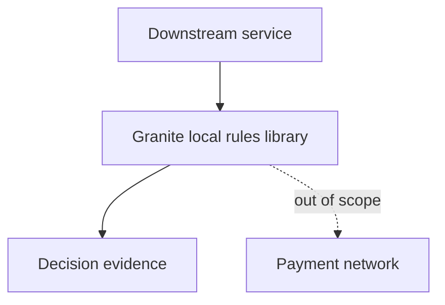

# Granite System Architecture

> **Authority and scope.** This document is the system-level architecture view for Granite. It visualizes and organizes what `GOAL.md`, `docs/product/prd.md`, `docs/roadmap/features.md`, and `docs/roadmap/current-status.md` establish. It does not redefine product goals, expand scope, or grant runtime/live approval.

## 0. How to read this document

Use this document for context, components, boundaries, and evidence mapping. For module-level detail, read `docs/design/technical-solution.md`.

> **Abstraction level.** Keep Granite's architecture at the design level — boundaries, responsibility splits, invariants, trust and approval gates, state/acceptance semantics, risk classes, and test strategy as intent. It does not carry concrete commands, shell pipelines, regex, or exact tool/verifier parameters; that mechanism lives in code, in `docs/plans/`, or in the verification tooling it configures.

## 1. Product boundary and system context

Granite sits between downstream services and local policy definitions. It owns deterministic rule evaluation and evidence. It does not own money movement or external payment-network calls.



### 1.1 Responsibility split

| Zone | Owns | Explicitly does not own |
|---|---|---|
| Downstream service | Business request, customer context, final user-facing behavior. | Rule engine internals. |
| Granite | Versioned local rules, validation, deterministic evidence. | Money movement, network calls, external messaging. |
| Payment network | Real settlement rails. | Local rule decisions. |

## 2. Container and component architecture

| Component | Responsibility | Evidence |
|---|---|---|
| Policy version gate | Validate rule version before evaluation. | Unit tests and decision evidence. |
| Fee evaluator | Produce local fee decisions. | Fee rule tests. |
| Settlement classifier | Classify local settlement windows. | Window classification tests. |
| Evidence builder | Return reproducible decision evidence. | Snapshot or structured-output checks. |

## 3. Trust and approval boundaries

Inputs from callers are untrusted until validated. Network calls, live settlement, release publication, and production configuration changes are outside ordinary implementation approval.

## 4. Lifecycle view

```text
request facts -> validate policy version -> evaluate fee/window -> build evidence -> caller interprets result
```

## 5. Architecture evidence gates

Architecture claims are accepted only when linked to PRD requirements, feature tracker rows, tests, diagrams, or reproducible artifacts.
