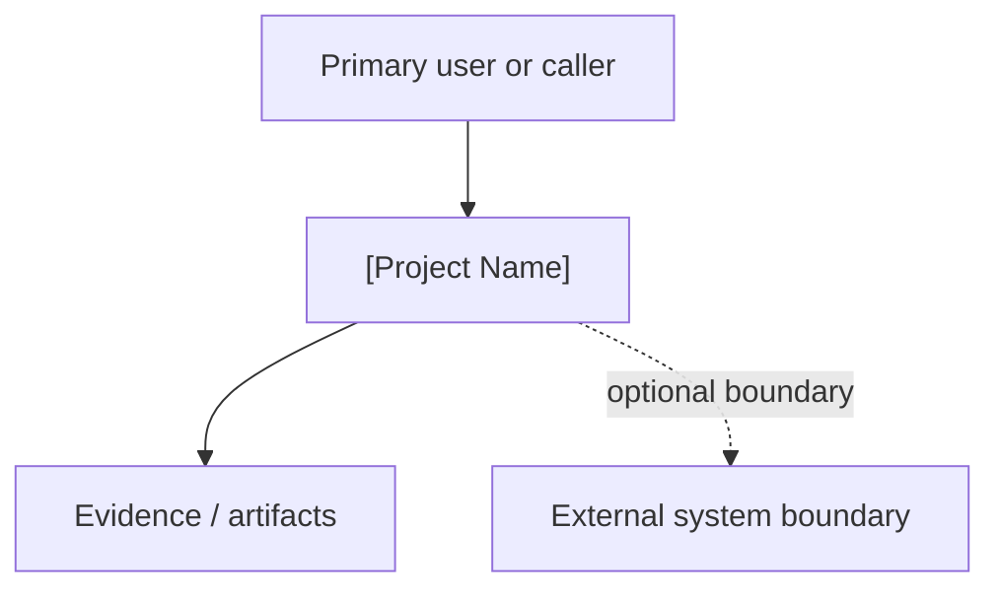

# [Project Name] System Architecture

> **Authority and scope.** This document is the system-level architecture view. It visualizes and organizes what `GOAL.md`, `docs/product/prd.md`, `docs/roadmap/features.md`, and `docs/roadmap/current-status.md` establish. It does not redefine product goals, expand scope, or grant runtime/live approval.

- For module-level technical detail, read `docs/design/technical-solution.md`.
- For product requirements, read `docs/product/prd.md`.
- For phase status and acceptance, read `docs/roadmap/current-status.md` and `docs/roadmap/features.md`.

## 0. How to read this document

Use this document for context, containers/components, lifecycles, boundaries, and evidence mapping.

### 0.1 Implementation-status markers

| Marker | Meaning |
|---|---|
| Done | Implemented as a real code path and backed by evidence. |
| Partial | Meaningful implementation exists but acceptance tails remain. |
| Planned | Product-required but not yet implemented. |
| Parked | Intentionally outside the current engineering sequence. |
| Non-goal | Explicitly not owned by this project. |

## 1. Product boundary and system context

[Project Name] sits between [callers/users] and [external boundary, if any]. It owns [responsibilities]. It does not own [adjacent responsibilities].



### 1.1 Responsibility split

| Zone | Owns | Explicitly does not own |
|---|---|---|
| Caller / user | [Responsibility] | [Responsibility not owned] |
| This project | [Responsibility] | [Adjacent system responsibility] |
| External boundary | [Responsibility] | [Responsibility not owned] |

## 2. Container and component architecture

Describe the major internal planes or components.

| Component | Responsibility | Evidence |
|---|---|---|
| [Component] | [Responsibility] | [Tests/docs/artifacts] |
| [Component] | [Responsibility] | [Tests/docs/artifacts] |

## 3. Trust and approval boundaries

State which inputs are trusted, which are untrusted, which operations are local-only, and which require higher approval gates.

## 4. Lifecycle views

Describe the core lifecycle from request to accepted evidence.

```text
intent -> plan -> implementation -> verification -> review -> merge -> post-merge status update
```

## 5. Architecture evidence gates

Architecture claims are accepted only when linked to PRD requirements, feature tracker rows, tests, diagrams, or reproducible artifacts.
